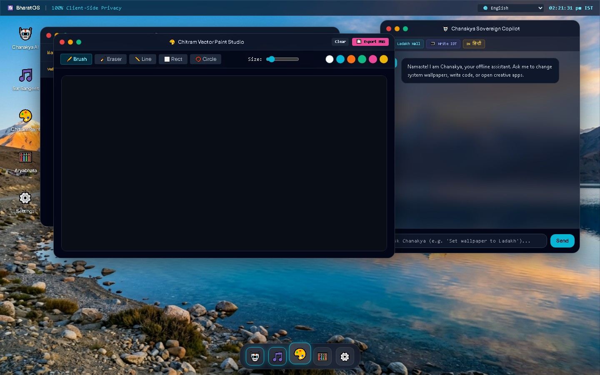

# ☸️ BharatOS 1.0 — A Web-Based Sovereign Desktop Environment



Hey! I'm **Aviral Dewangan** (@AviralDewangan14).  
This is **BharatOS 1.0**, a web desktop environment that I built from scratch using HTML5, modern CSS, and vanilla JavaScript. Everything runs entirely in the browser with 0 external tracking or cloud telemetry.

---

## 🚀 Live Demo & Quick Testing
- **Live Desktop:** [https://bharatos1-0.vercel.app/os](https://bharatos1-0.vercel.app/os)
- **Lock Screen PIN:** `1234` (or click **⚡ QUICK UNLOCK**)

---

## 🛠️ What I Built & How It Works

### 1. 🪟 Custom Window Manager (`js/window_manager.js`)
- Hand-wrote a draggable window system without external UI libraries.
- Uses `mousedown`, `mousemove`, and `mouseup` event listeners to calculate dynamic viewport offsets and keep windows inside screen bounds.
- Tracks `topZIndex` counter to bring clicked windows to the front when focused.
- Window controls for Minimize, Maximize, and Close with smooth CSS transitions.

### 2. 🎵 Web Audio DSP Synthesizer (`js/apps/sangeet.js`)
- Built an interactive synthesizer using the browser's native `AudioContext` and `OscillatorNode`.
- Supports 4 waveforms: Sine (harmonic), Triangle (warm), Sawtooth (strings), and Square (8-bit chiptune).
- Programmed a responsive piano keyboard spanning octaves 1 through 8 with precise Hz note frequencies (Sa=261.63Hz, Re=293.66Hz, Ga=329.63Hz, etc.).
- Includes Vedic harmonic frequencies (396 Hz, 528 Hz, 639 Hz, 963 Hz).

### 3. 🎨 Canvas 2D Vector Paint Studio (`js/apps/chitram.js`)
- HTML5 Canvas drawing tool with freehand Brush, Eraser, Line, Rectangle, and Circle tools.
- Uses 2D canvas context imageData buffering (`getImageData` / `putImageData`) to preview geometric shapes in real-time before committing strokes.
- Includes color palette picker, stroke size slider, canvas clear, and instant PNG export (`canvas.toDataURL()`).

### 4. 🧮 Aryabhata Calculator & Function Grapher (`js/apps/aryabhata.js`)
- Scientific calculator with support for arithmetic, powers, square roots, and trigonometric functions (`sin`, `cos`, `tan`).
- Real-time conversion to Hexadecimal (`0x...`) and Binary (`0b...`).
- 2D cartesian coordinate plotter on a custom HTML5 canvas that dynamically graphs mathematical functions (e.g. `Math.sin(x * 2) * Math.cos(x)`).

### 5. 🤖 Chanakya Offline Copilot (`js/apps/chanakya.js`)
- Fast client-side command assistant that lets you control the OS with natural text.
- Can change desktop wallpapers, switch system language, open apps, and display low-level kernel code snippets.

---

## 📂 Project Structure

```
bharatos/
├── css/
│   └── style.css            # Custom CSS variables, glassmorphism & layout
├── js/
│   ├── window_manager.js    # Drag, z-index elevation, maximize/minimize
│   ├── lockscreen.js        # Passcode check (1234) & live IST clock
│   ├── apps/
│   │   ├── chanakya.js      # Offline assistant logic & wallpaper switcher
│   │   ├── sangeet.js       # Web Audio API 8-channel synthesizer
│   │   ├── chitram.js       # Canvas 2D paint tools & PNG export
│   │   ├── aryabhata.js     # Scientific calculator & 2D graph plotter
│   │   └── settings.js      # Wallpaper switcher & language dictionaries
│   └── main.js              # DOM initialization & startup
├── wallpapers/              # High-resolution landscape wallpapers
└── index.html               # Semantic HTML desktop markup (~450 lines)
```

---

## 💻 Running Locally

No complicated setup or build tools required:

```bash
# Clone the repository
git clone https://github.com/AviralDewangan14/bharatos1.0.git
cd bharatos1.0

# Open in any browser or launch a local server:
python -m http.server 8000
```
Then visit `http://localhost:8000/public/index.html` or `http://localhost:8000/bharatos/index.html`.

---

## 👤 Author & Contact
- **Developer:** Aviral Dewangan
- **GitHub:** [@AviralDewangan14](https://github.com/AviralDewangan14)
- **Discord:** `@AviralDewangan` (Available in `#ask-the-shipwrights`)
- **Reviewer Note:** If you have any feedback or questions, please feel free to DM me!
