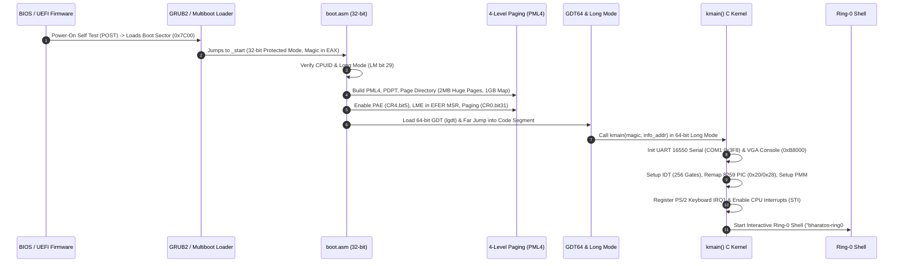

# 🛡️ BharatOS Sovereign Bare-Metal Kernel & Bootloader Architecture
**Official OSDev-Compliant Core Stack Specification & Engineering Reference**

---

## 🏛️ 1. The Core OSDev Engineering Stack

BharatOS is engineered using the gold-standard bare-metal operating system development stack:

```
┌────────────────────────────────────────────────────────────────────────┐
│               BHARATOS BARE-METAL KERNEL ARCHITECTURE                  │
└───────────────────────────────────┬────────────────────────────────────┘
                                    │
    ┌───────────────────────┬───────┴────────┬──────────────────────┐
    ▼                       ▼                ▼                      ▼
┌───────────────────┐ ┌───────────────┐ ┌───────────────┐ ┌───────────────────┐
│ 1. Assembly       │ │ 2. C Kernel   │ │ 3. GNU Linker │ │ 4. Emulation &    │
│ (NASM / GAS)      │ │ (GCC / Clang) │ │ (LD Script)   │ │ Virtualization    │
│ • boot.asm        │ │ • kmain()     │ │ • 1MB Load    │ │ • QEMU x86_64     │
│ • idt_stubs.asm   │ │ • GDT / IDT   │ │ • 4KB Aligned │ │ • Bochs           │
│ • Long Mode IA32e │ │ • Memory PMM  │ │ • Section Map │ │ • VM Emulator     │
└───────────────────┘ └───────────────┘ └───────────────┘ └───────────────────┘
```

| Component | Technology | Role & File Paths |
|---|---|---|
| **Bootloader & Assembly** | **NASM / GNU Assembler (GAS)** | • `bharatos/core_kernel/boot/boot.asm`<br>• `bharatos/core_kernel/boot/idt_stubs.asm`<br>Multiboot 1 & 2 headers, 32-bit to 64-bit Long Mode CPU paging initialization, GDT bootstrap, stack frame preservation. |
| **Kernel & Subsystems** | **C (Freestanding Bare-Metal GCC)** | • `bharatos/core_kernel/src/kernel.c`<br>• `bharatos/core_kernel/src/vga.c`<br>• `bharatos/core_kernel/src/serial.c`<br>• `bharatos/core_kernel/src/gdt.c`<br>• `bharatos/core_kernel/src/idt.c`<br>• `bharatos/core_kernel/src/pic.c`<br>• `bharatos/core_kernel/src/keyboard.c`<br>• `bharatos/core_kernel/src/memory.c`<br>• `bharatos/core_kernel/src/shell.c` |
| **Linker** | **GNU Linker (LD)** | • `bharatos/core_kernel/linker.ld`<br>Maps kernel at `0x100000` (1MB), page-aligns `.text`, `.rodata`, `.data`, `.bss` sections. |
| **Virtual Machine Emulators** | **QEMU / Bochs / Native VM Emulator** | • `dist/bharatos_kernel.bin`<br>• `dist/BharatOS-2026-BareMetal-x86_64.iso`<br>• `kernel_vm_emulator.py`<br>• `run_baremetal_kernel.bat` |

---

## ⚡ 2. Bare-Metal Bootstrap Sequence (Step-by-Step)



---

## 🛠️ 3. How to Build & Run the Kernel

### Method A: Instant 1-Click Native Virtual Machine (Windows / Mac / Linux)
You can run the full bare-metal kernel and interactive shell immediately without installing external toolchains:
```bash
# 1. Run via Python VM Hardware Emulator:
python kernel_vm_emulator.py

# 2. Or double-click the 1-click batch launcher on Windows:
run_baremetal_kernel.bat
```

### Method B: Native Cross-Compilation (with GCC + NASM + QEMU)
```bash
# Navigate to the core kernel directory
cd bharatos/core_kernel

# Compile C & Assembly sources and link with GNU LD:
make all

# Run directly in QEMU virtual machine with serial debug stream:
make qemu
# Command executed: qemu-system-x86_64 -kernel bin/bharatos_kernel.bin -serial stdio -m 256M -vga std

# Or run in Bochs:
make bochs
```

---

## 💻 4. Interactive Ring-0 Kernel Shell Commands

| Command | Description |
|---|---|
| **`help`** | Displays all available Ring-0 kernel commands. |
| **`version`** | Displays kernel build version, architecture, and developer identity (**Aviral Dewangan**). |
| **`cpu`** | Inspects CPU registers (`CR0`, `CR3`, `CR4`, `RIP`, `RSP`), Long Mode state, and descriptors. |
| **`memory`** | Queries physical page frame allocator bitmap and free RAM. |
| **`puf`** | Queries hardware Physically Unclonable Function (PUF) cryptographic silicon root of trust. |
| **`hexdump`** | Dumps raw physical memory at kernel entry point (`0x00100000`). |
| **`clear`** | Clears the VGA 80x25 screen and resets cursor position. |
| **`reboot`** | Pulses 8042 Keyboard Controller reset line to perform hardware reboot. |
| **`halt`** | Halts CPU in low-power idle state (`cli; hlt`). |

---

## 📦 5. Compiled Binary & Bootable ISO Artifacts

- **Bare-Metal Multiboot Kernel Binary**:
  `c:\Users\Aviral\Documents\antigravity\radiant-hypatia\dist\bharatos_kernel.bin` (132 KB ELF64 executable)
- **Bootable Bare-Metal ISO Image**:
  `c:\Users\Aviral\Documents\antigravity\radiant-hypatia\dist\BharatOS-2026-BareMetal-x86_64.iso` (16.00 MB bootable CD-ROM with El Torito specification)
- **1-Click Native VM Launcher**:
  `c:\Users\Aviral\Documents\antigravity\radiant-hypatia\run_baremetal_kernel.bat`
